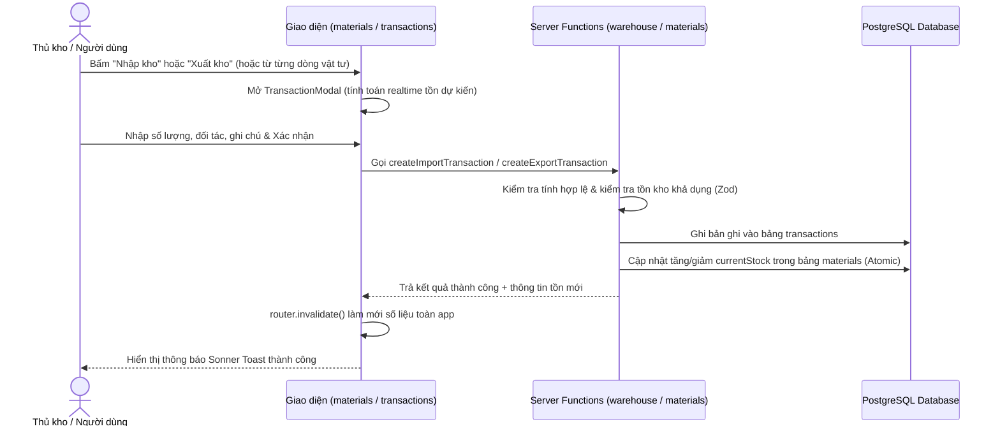

# 🟢 Giai đoạn 2: Quản lý Vật tư & Nhập/Xuất kho

**Thời gian ước tính:** 3-4 ngày  
**Tương ứng BPMN:** Khối 2 - Nghiệp vụ Kho  
**Trạng thái:** ✅ Đã hoàn thành (100%)

## Công việc chi tiết & Kết quả thực hiện

| # | Task | Mô tả | Trạng thái | Chi tiết triển khai |
|---|------|-------|:----------:|-------------------|
| 2.1 | CRUD Danh mục Vật tư | Thêm, sửa, xóa, tìm kiếm vật tư | ✅ Hoàn thành | Giao diện quản lý tại `src/routes/materials.tsx`, modal thêm/sửa `MaterialModal.tsx`, dialog xác nhận xóa an toàn `DeleteMaterialDialog.tsx`, bộ lọc trạng thái (Thiếu hàng, Chuẩn, Vượt Max). |
| 2.2 | Server Functions materials | `getAllMaterials`, `getMaterialById`, `createMaterial`, `updateMaterial`, `deleteMaterial` | ✅ Hoàn thành | File `src/server/functions/materials.ts` với đầy đủ Zod validation, kiểm tra trùng mã vật tư, kiểm tra Min/Max và ràng buộc toàn vẹn dữ liệu. |
| 2.3 | Form Nhập kho | Chọn vật tư, nhập SL, đối tác, ghi chú → cập nhật tồn | ✅ Hoàn thành | Component `TransactionModal.tsx` (mode `IMPORT`), hỗ trợ chọn vật tư, nút tăng nhanh (+10, +50, +100, +500), tính toán dự phóng tồn kho sau nhập, thông báo Sonner toast. |
| 2.4 | Form Xuất kho | Chọn vật tư, nhập SL, đối tác → kiểm tra tồn → cập nhật | ✅ Hoàn thành | Component `TransactionModal.tsx` (mode `EXPORT`), kiểm tra tồn kho theo thời gian thực (chặn xuất nếu SL > tồn), cảnh báo nếu tồn sau xuất < Min, trừ tồn kho tự động. |
| 2.5 | Server Functions warehouse | `createImportTransaction`, `createExportTransaction`, `getWarehouseTransactions` | ✅ Hoàn thành | File `src/server/functions/warehouse.ts`, xử lý transaction nguyên tử với `db.transaction`, ghi log vào bảng `transactions` và cập nhật tức thời `materials.currentStock`. |
| 2.6 | Lịch sử giao dịch | Bảng hiển thị lịch sử nhập/xuất (TanStack Table) | ✅ Hoàn thành | Giao diện tại `src/routes/transactions.tsx`, gồm 4 thẻ KPI tóm tắt, bộ lọc phân loại (Tất cả / Nhập kho / Xuất kho), tìm kiếm theo mã/tên/đối tác, sắp xếp đa cột, phân trang. |
| 2.7 | Cập nhật tồn kho tự động | Logic trong server function sau mỗi giao dịch | ✅ Hoàn thành | Thực hiện trong `db.transaction` tại `warehouse.ts`, đồng bộ hóa realtime và kích hoạt `router.invalidate()` trên client để làm mới giao diện tức thì. |

## Luồng xử lý đã triển khai

## Các thành phần mã nguồn đã tạo mới & nâng cấp
1. **Server Functions:**
   - [`src/server/functions/warehouse.ts`](file:///c:/Users/admin/OneDrive/Máy tính/quan-ly-kho/src/server/functions/warehouse.ts): `createImportTransaction`, `createExportTransaction`, `getWarehouseTransactions`.
   - [`src/server/functions/materials.ts`](file:///c:/Users/admin/OneDrive/Máy tính/quan-ly-kho/src/server/functions/materials.ts): Thêm `createMaterial`, `updateMaterial`, `deleteMaterial`, `getMaterialById`.
   - [`src/server/functions/transactions.ts`](file:///c:/Users/admin/OneDrive/Máy tính/quan-ly-kho/src/server/functions/transactions.ts): Nâng cấp bộ lọc loại giao dịch (`ALL`, `IMPORT`, `EXPORT`).

2. **Components:**
   - [`src/components/warehouse/MaterialModal.tsx`](file:///c:/Users/admin/OneDrive/Máy tính/quan-ly-kho/src/components/warehouse/MaterialModal.tsx): Modal Thêm/Sửa vật tư với chips ĐVT nhanh, kiểm soát Min/Max.
   - [`src/components/warehouse/DeleteMaterialDialog.tsx`](file:///c:/Users/admin/OneDrive/Máy tính/quan-ly-kho/src/components/warehouse/DeleteMaterialDialog.tsx): Dialog xóa an toàn, kiểm tra ràng buộc chứng từ lịch sử.
   - [`src/components/warehouse/TransactionModal.tsx`](file:///c:/Users/admin/OneDrive/Máy tính/quan-ly-kho/src/components/warehouse/TransactionModal.tsx): Form nhập/xuất kho đa năng, dự phóng số dư và chống xuất âm kho.

3. **Routes:**
   - [`src/routes/materials.tsx`](file:///c:/Users/admin/OneDrive/Máy tính/quan-ly-kho/src/routes/materials.tsx): Trang danh mục vật tư với 4 thẻ KPI, nút nhập/xuất nhanh, sửa/xóa và lọc trạng thái kho.
   - [`src/routes/transactions.tsx`](file:///c:/Users/admin/OneDrive/Máy tính/quan-ly-kho/src/routes/transactions.tsx): Trang nhật ký nhập/xuất với thẻ tổng quan số liệu, tabs phân loại, tìm kiếm và phân trang.

## Output giai đoạn 2
- ✅ CRUD danh mục vật tư hoàn chỉnh (Thêm, Sửa, Xóa có ràng buộc, Tìm kiếm & Lọc).
- ✅ Chức năng Nhập kho với tính năng dự phóng tồn kho và ghi nhật ký tự động.
- ✅ Chức năng Xuất kho với kiểm soát nghiêm ngặt tồn khả dụng (ngăn xuất âm).
- ✅ Lịch sử giao dịch nhập/xuất chi tiết, phân loại trực quan theo màu sắc và mã đối tác.
- ✅ Tồn kho tự động cập nhật nguyên tử (`Atomic Transactions`) và đồng bộ lên Dashboard.
- ✅ Build ứng dụng thành công (`npm run build`), SSR hoạt động chuẩn xác trên runtime.
