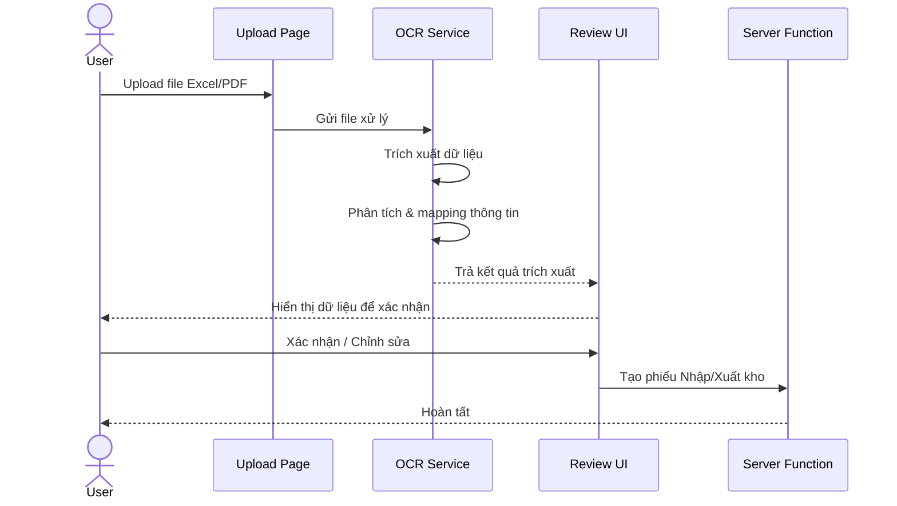

# 🟣 Giai đoạn 6: AI OCR - Trích xuất Dữ liệu

**Thời gian ước tính:** 3-4 ngày
**Tương ứng BPMN:** Khối 1 - Tiếp nhận & Trích xuất Dữ liệu

## Công việc chi tiết
| # | Task | Mô tả |
|---|------|-------|
| 6.1 | Upload chứng từ | Drag & drop upload Excel/PDF |
| 6.2 | Parse file Excel | Đọc và trích xuất dữ liệu từ `.xlsx` |
| 6.3 | OCR cho PDF | Sử dụng Tesseract.js trích xuất text từ PDF/ảnh |
| 6.4 | Phân tích thông tin | AI mapping: xác định Mã VT, Tên, SL, ĐVT, KH |
| 6.5 | Review & Confirm | UI cho user xem lại dữ liệu trích xuất trước khi xử lý |
| 6.6 | Tự động tạo phiếu | Từ dữ liệu trích xuất → tạo phiếu nhập/xuất kho |

## Luồng OCR

## Output giai đoạn 6
- ✅ Upload Excel/PDF
- ✅ Trích xuất dữ liệu tự động
- ✅ Giao diện review dữ liệu
- ✅ Tự động tạo phiếu từ chứng từ
