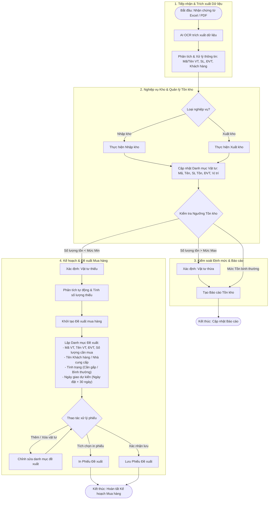

```mermaid
flowchart TD
    subgraph Sub_Input["1. Tiếp nhận & Trích xuất Dữ liệu"]
        A1([Bắt đầu: Nhận chứng từ Excel / PDF]) --> A2[AI OCR trích xuất dữ liệu]
        A2 --> A3[Phân tích & Xử lý thông tin: Mã/Tên VT, SL, ĐVT, Khách hàng]
    end

    subgraph Sub_Warehouse["2. Nghiệp vụ Kho & Quản lý Tồn kho"]
        A3 --> B1{Loại nghiệp vụ?}
        B1 -->|Nhập kho| B2[Thực hiện Nhập kho]
        B1 -->|Xuất kho| B3[Thực hiện Xuất kho]
        B2 --> B4[Cập nhật Danh mục Vật tư: Mã, Tên, SL Tồn, ĐVT, Vị trí]
        B3 --> B4
        B4 --> B5{Kiểm tra Ngưỡng Tồn kho}
    end

    subgraph Sub_Report["3. Kiểm soát Định mức & Báo cáo"]
        B5 -->|Số lượng tồn > Mức Max| C1[Xác định: Vật tư thừa] --> C3[Tạo Báo cáo Tồn kho]
        B5 -->|Mức Tồn bình thường| C3
    end

    subgraph Sub_Procurement["4. Kế hoạch & Đề xuất Mua hàng"]
        B5 -->|Số lượng tồn < Mức Min| D1[Xác định: Vật tư thiếu]
        D1 --> D2[Phân tích tự động & Tính số lượng thiếu]
        D2 --> D3[Khởi tạo Đề xuất mua hàng]
        D3 --> D4["Lập Danh mục Đề xuất:<br/>- Mã VT, Tên VT, ĐVT, Số lượng cần mua<br/>- Tên Khách hàng / Nhà cung cấp<br/>- Tình trạng (Cần gấp / Bình thường)<br/>- Ngày giao dự kiến (Ngày đặt + 30 ngày)"]
        D4 --> D5{Thao tác xử lý phiếu}
        D5 -->|Thêm / Xóa vật tư| D6[Chỉnh sửa danh mục đề xuất] --> D5
        D5 -->|Tích chọn in phiếu| D7[In Phiếu Đề xuất]
        D5 -->|Xác nhận lưu| D8[Lưu Phiếu Đề xuất]
    end

    C3 --> End1([Kết thúc: Cập nhật Báo cáo])
    D7 --> End2([Kết thúc: Hoàn tất Kế hoạch Mua hàng])
    D8 --> End2
```